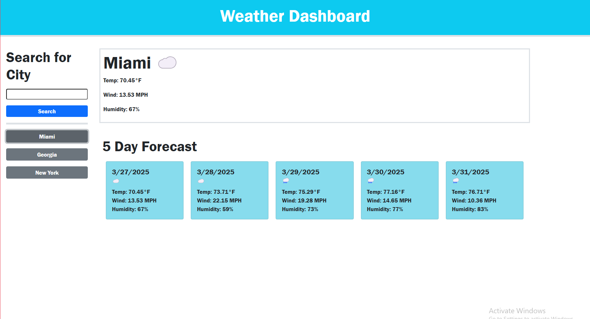

# Weather Dashboard 

## Table of Contents
- [Description](#description)
- [Installation](#installation)
- [Usage](#usage)
- [Questions](#questions)

## Description
Weather Dashboard is an application that lets you enter in the city you are looking for and see the current weather and the weekly weather. included with a innovative history bar you will know the weather even when you travel often.

## Installation
by downloading the github demo and cloning it into your terminal.

## Usage
Simply type in the search bar the desired city you want to find the weather of and easily you will be provided the data. any place you type will be saved in the search history side bar for easy access.

## Questions
For any questions, you can reach me at:
- GitHub: [MIKEYP53](https://github.com/MIKEYP53)
- Email: mprz646@gmail.com